# PLC Projects

This repository contains various PLC projects, each focusing on different industrial automation applications. Below are the descriptions of the projects, their requirements, and the associated files.

## Table of Contents

1. [Requirements](#requirements)
2. [Project 1: Variable Frequency Drive Controlled Fan by Temperature Sensor](#project-1-variable-frequency-drive-controlled-fan-by-temperature-sensor)
3. [Project 2: Tank Water Level Control by PIDAT](#project-2-tank-water-level-control-by-pidat)
4. [Project 3: PROCON Water Tank Monitoring and Control](#project-3-procon-water-tank-monitoring-and-control)
5. [Project 4: Electric Power System SCADA](#project-4-electric-power-system-scada)
6. [Additional Notes](#additional-notes)

## Requirements

These projects require the following software and hardware from **OMRON**:

- **OMRON CP1H PLC**: A versatile programmable logic controller for industrial applications.
- **CX-Programmer**: Software used to program the **CP1H PLC** using ladder logic. The project files for this software have the extension **.cxp**.
- **CX-Designer**: Software used to design and configure **HMI (Human Machine Interface)** systems. The project files for this software have the extension **.cdt**.
- **CX-Supervisor**: SCADA (Supervisory Control and Data Acquisition) software for monitoring and controlling industrial processes. The project files for this software are typically **.scs** for project files, **.sr3** for runtime files, and **.cdm** for communication files.

## Project 1: Variable Frequency Drive Controlled Fan by Temperature Sensor

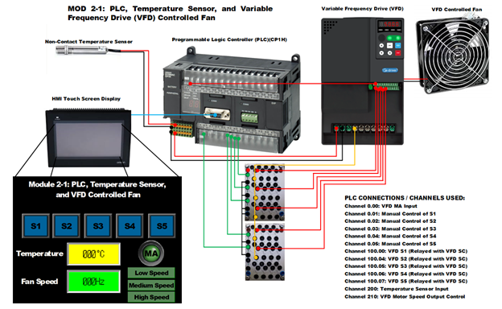

This project controls a fan speed based on temperature readings from a sensor using a Variable Frequency Drive (VFD). The system adjusts the fan speed to maintain a constant temperature.

[View the project folder](./1_Variable_Frequency_Drive_Controlled_Fan_by_Temperature_Sensor)

## Project 2: Tank Water Level Control by PIDAT

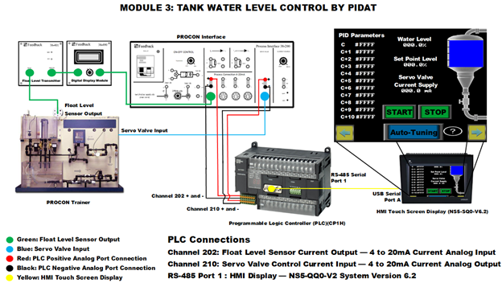

This project implements a PID control system to maintain the water level in a tank by adjusting the input flow rate. The PID algorithm is used for fine control.

[View the project folder](./2_Tank_Water_Level_Control_by_PIDAT)

## Project 3: PROCON Water Tank Monitoring and Control

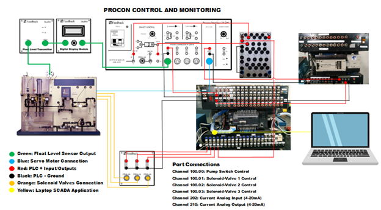
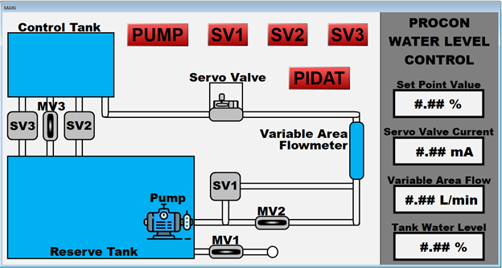

This project monitors and controls a water tank system using **PROCON** SCADA software, which communicates with the PLC for real-time control and data visualization.

[View the project folder](./3_PROCON_Water_Tank_Monitoring_and_Control)

## Project 4: Electric Power System SCADA

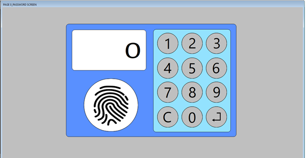
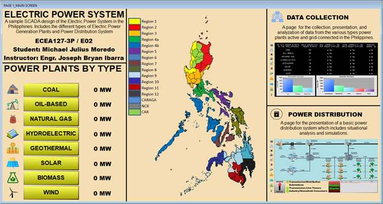
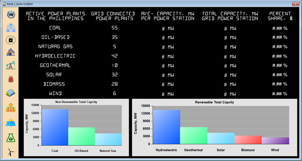
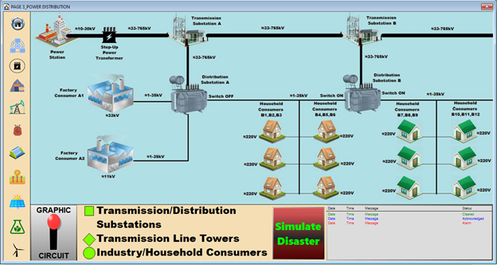
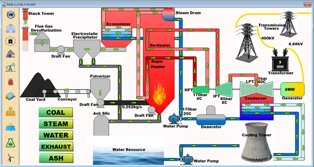
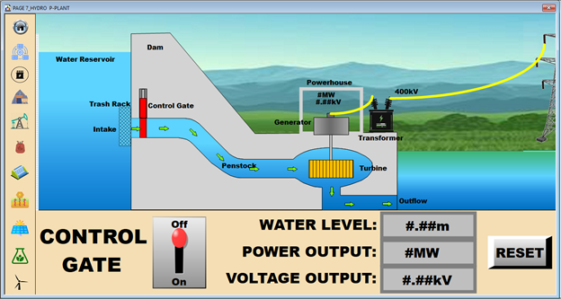
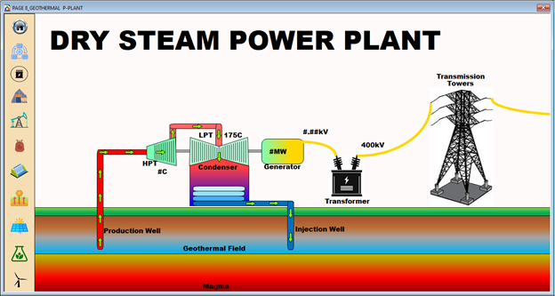
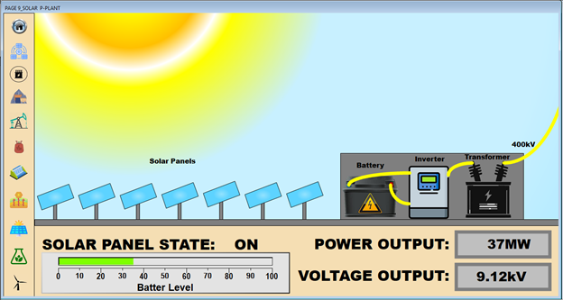
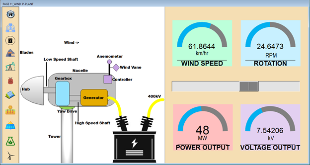

This project showcases a SCADA system used for monitoring and controlling an electric power system. It provides real-time data visualization and control for power distribution systems.

[View the project folder](./4_Electric_Power_System_SCADA)

## Additional Notes

- Ensure you have the required **OMRON hardware** and **software** installed to open and modify these projects.
- **.cxp** files can be opened with **CX-Programmer** to modify the PLC logic.
- **.cdt** files can be opened with **CX-Designer** to edit the HMI screens.
- **.scs**, **.sr3**, and **.cdm** files are for the **CX-Supervisor** SCADA system and are used for controlling and monitoring the system in real-time.

Feel free to explore each project folder for detailed project files, documentation, and resources.
